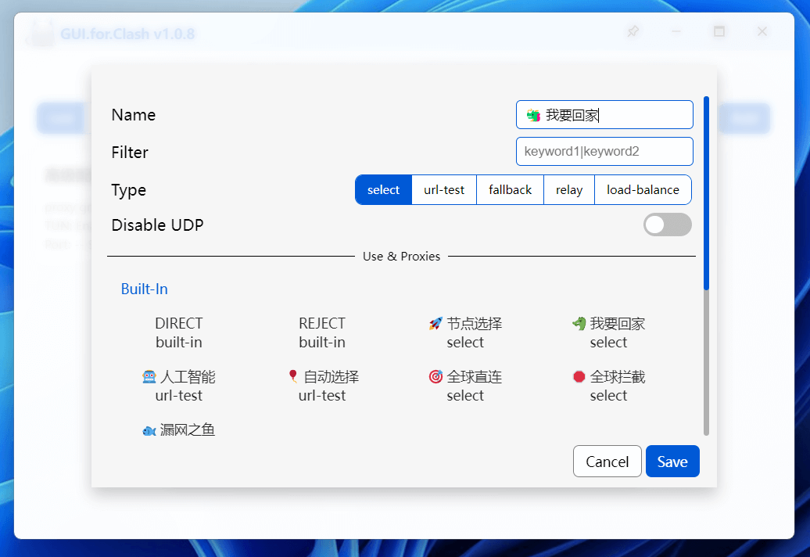
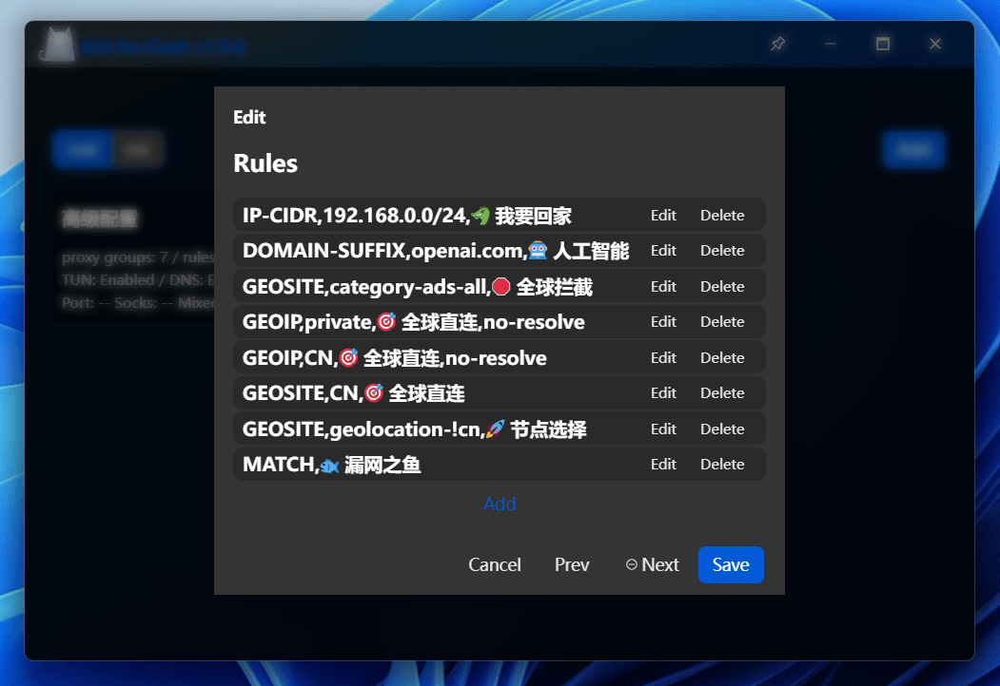

<h1 align="center">
  
  <br>GUI.for.Clash<br>
</h1>

<h4 align="center">A GUI program developed by vue3 + wails.</h4>

## Preview

<div>
  
  
  <br/>
  
  
  <br/>
  
  
  <br/>
  
  
  <br/>
  
  
  <br/>
  
  
</div>

## Build

1、Build Environment

- Node.js [link](https://nodejs.org/en)

- pnpm ：`npm i -g pnpm`

- Go [link](https://go.dev/)

- Wails [link](https://wails.io/) ：`go install github.com/wailsapp/wails/v2/cmd/wails@latest`

2、Pull and Build

```
git clone https://github.com/onejibang/GUI.for.Clash.git

cd GUI.for.Clash

wails build -m -trimpath
```
