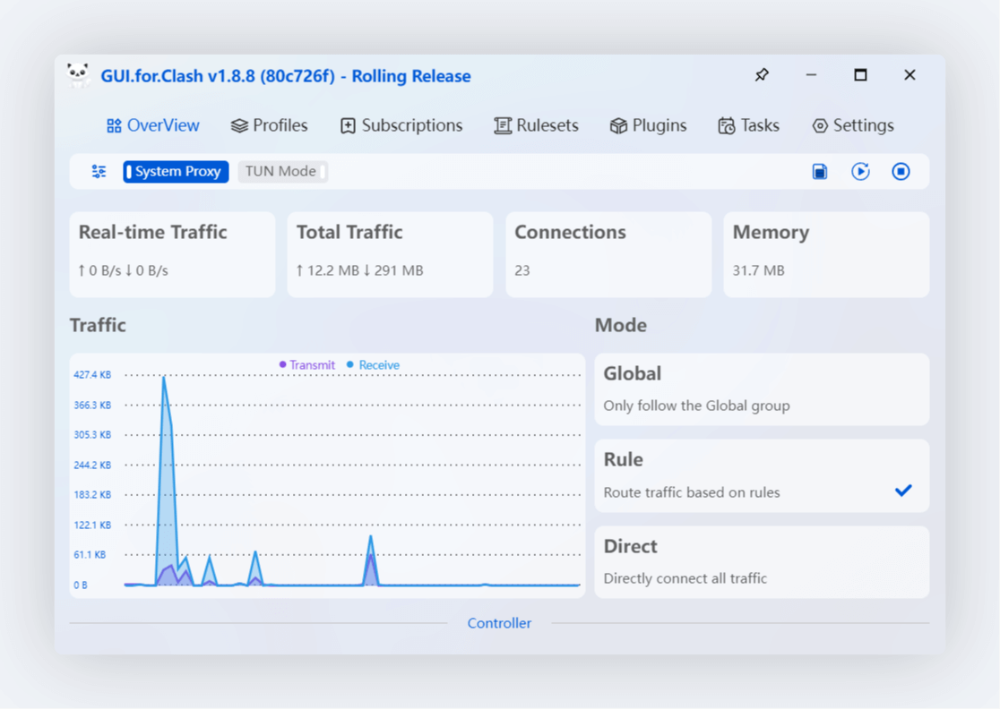

## Preview

Take a look at the live version here: 👉 <a href="https://gui-for-cores.github.io/guide/gfc/" target="_blank">Live Demo</a>

<div align="center">
  
</div>

## Document

[how-to-use](https://gui-for-cores.github.io/guide/gfc/how-to-use)

## Build

1、Build Environment

- Node.js [link](https://nodejs.org/en)

- pnpm ：`npm i -g pnpm`

- Go [link](https://go.dev/)

- Wails [link](https://wails.io/) ：`go install github.com/wailsapp/wails/v2/cmd/wails@latest`

2、Pull and Build

```bash
git clone https://github.com/GUI-for-Cores/GUI.for.Clash.git

cd GUI.for.Clash/frontend

pnpm install --frozen-lockfile && pnpm build

cd ..

wails build
```

## Stargazers over time

[](https://starchart.cc/GUI-for-Cores/GUI.for.Clash)
